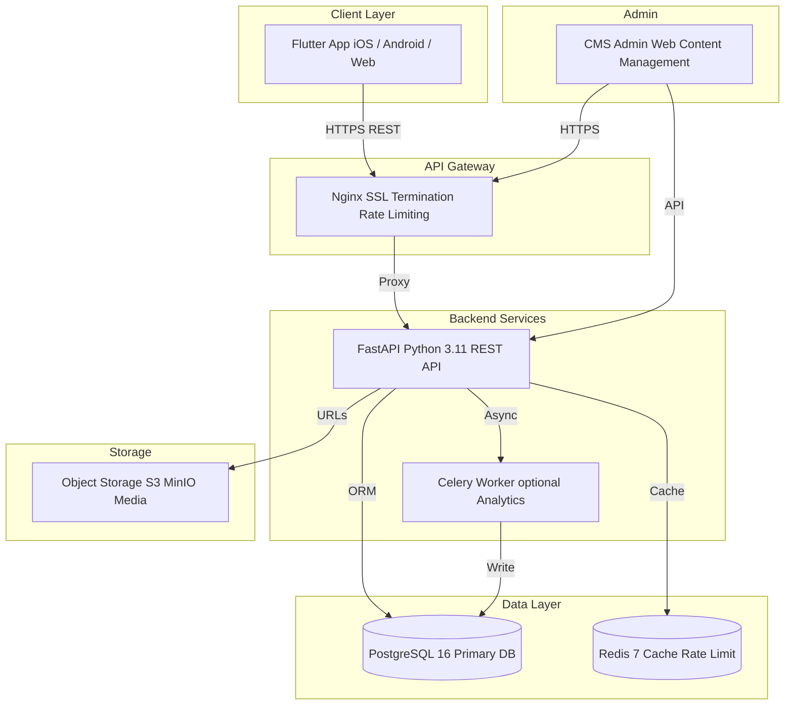

# MI Academy MVP — Technical Architecture

> **Version:** 1.0 — MVP
> **Ngày:** 16/07/2026
> **Trạng thái:** Draft
> **Tech Lead:** TBD

---

## Mục lục

1. [Kiến trúc tổng quan](#1-kiến-trúc-tổng-quan)
2. [Frontend Stack](#2-frontend-stack)
3. [Backend Stack](#3-backend-stack)
4. [Cấu trúc Flutter Project](#4-cấu-trúc-flutter-project)
5. [Cấu trúc Backend Project](#5-cấu-trúc-backend-project)
6. [Offline-First Strategy](#6-offline-first-strategy)
7. [Data Flow chi tiết](#7-data-flow-chi-tiết)
8. [Authentication Flow](#8-authentication-flow)
9. [API Versioning](#9-api-versioning)
10. [Deployment](#10-deployment)
11. [Observability](#11-observability)
12. [Performance Targets](#12-performance-targets)
13. [Security Headers](#13-security-headers)
14. [Thư viện Frontend (pubspec.yaml)](#14-thư-viện-frontend-pubspecyaml)
15. [Thư viện Backend (requirements.txt)](#15-thư-viện-backend-requirementstxt)
16. [Phụ lục](#16-phụ-lục)

---

## 1. Kiến trúc tổng quan

MI Academy sử dụng kiến trúc client-server với offline-first. Flutter chạy iOS/Android/Web, FastAPI backend qua REST, PostgreSQL, CMS admin web.

## 1. Kiến trúc tổng quan

MI Academy sử dụng kiến trúc client-server với offline-first. Flutter chạy iOS/Android/Web, kết nối tới FastAPI backend qua REST API, PostgreSQL làm database chính, Redis cho cache. CMS admin web cho phép quản trị viên quản lý nội dung bài học.

### Sơ đồ kiến trúc (Mermaid)



### Sơ đồ ASCII

```
Flutter App     FastAPI          PostgreSQL
(iOS/And/Web)---->Backend----------->16
      <----           |                  
                       |            Redis 7
                       |           (cache+rate)
CMS Admin              |
Web---------------->   |
                       |
                       +------->Object Storage(S3)
```

### Quy tắc giao tiếp

| Kết nối | Giao thức | Ghi chú |
|---------|-----------|----------|
| App to Backend | HTTPS REST JSON | api.miacademy.app/v1 |
| App to Backend realtime | WebSocket optional | Push notification nội bộ |
| Backend to PostgreSQL | TCP TLS | asyncpg connection pool |
| Backend to Redis | TCP | Sentinel Cluster cho HA |
| Backend to Storage | HTTPS | Presigned URL media |
| CMS to Backend | HTTPS REST | Cùng API role-based access |

---

## 2. Frontend Stack

Ứng dụng Flutter là lớp giao diện duy nhất cho trẻ em, thiết kế offline-first với khả năng chạy hoàn toàn trên thiết bị sau khi tải nội dung.

### Danh sách công nghệ

| Thành phần | Công nghệ | Mục đích |
|------------|-----------|----------|
| Framework | Flutter 3.x stable | UI cross-platform iOS Android Web |
| Language | Dart 3.x | Null-safety pattern matching |
| Game Engine | Flame 1.x | 2D game engine cho mini-games |
| Animation | Rive runtime | MI character animations real-time interactive |
| Effects | Lottie | Phần thưởng transitions confetti effects |
| Offline Storage | Hive Isar | NoSQL local database cache queue |
| State Management | Riverpod 2.x | Reactive state dependency injection |
| Navigation | GoRouter | Declarative routing deep links guards |
| i18n | intl flutter_localizations | Đa ngôn ngữ vi en locale-aware formatting |
| DI | Riverpod built-in providers | Service locator pattern |
| Network | Dio 5.x | HTTP client interceptors retry |
| Env Config | flutter_dotenv | Build-time runtime config |

### Chiến lược rendering

- UI screens profile world_map lessons list: Flutter widgets tiêu chuẩn 60fps target.
- Game surfaces: Flame GameWidget embedded trong Flutter widget tree.
- Character MI: Rive RiveAnimation widget với state machine điều khiển theo progress.
- Reward effects: Lottie LottieBuilder overlay auto-dispose sau animation.

---

## 3. Backend Stack

Backend FastAPI cung cấp REST API authentication sync engine và content delivery.

### Danh sách công nghệ

| Thành phần | Công nghệ | Mục đích |
|------------|-----------|----------|
| Framework | FastAPI latest | ASGI web framework auto OpenAPI docs |
| Language | Python 3.11 | Async await performance tốt |
| ORM | SQLAlchemy 2.0 | Type-annotated ORM async sessions |
| Migration | Alembic | Database schema versioning |
| Database | PostgreSQL 16 | Primary datastore JSONB UUID |
| Cache | Redis 7 | Cache layer rate limiting sync locks |
| Task Queue | Celery optional | Async analytics report generation |
| Broker | Redis RabbitMQ | Celery message broker |
| Validation | Pydantic v2 | Request response schemas |
| Auth | python-jose PyJWT | JWT access refresh tokens |
| Password | bcrypt passlib | PIN hashing 12 rounds |
| ASGI Server | Uvicorn Gunicorn | Production workers |

### Cấu hình ASGI

```python
# gunicorn app.main:app -k uvicorn.workers.UvicornWorker -w 4
# Hoặc: uvicorn app.main:app --workers 4 --proxy-headers
```

### Connection Pooling

- App dùng asyncpg driver qua SQLAlchemy async engine.
- Pool size: 10 production max overflow: 20.
- Redis connection pool reuse để tránh overhead handshake.

---

## 4. Cấu trúc Flutter Project

Áp dụng feature-first architecture kết hợp Clean Architecture data domain presentation.

### Sơ đồ thư mục

```
lib/
  main.dart                           Entry point
  app.dart                            MaterialApp routing theme

  core/                               Shared foundation
    constants/
      app_colors.dart                 Color palette
      app_text_styles.dart            Typography
      app_dimensions.dart             Spacing radius
      app_assets.dart                 Asset paths
    theme/
      app_theme.dart                  ThemeData
      dark_theme.dart                Dark mode future
    l10n/                             Generated i18n files
      app_vi.arb
      app_en.arb
    utils/
      logger.dart
      validators.dart
      platform_utils.dart
    extensions/
      context_ext.dart
      date_ext.dart

  data/                               Data access layer
    api/
      api_client.dart                 Dio instance interceptors
      api_endpoints.dart              URL constants
      api_error_handler.dart
    repositories/
      lesson_repository.dart
      profile_repository.dart
      sync_repository.dart
    sources/
      local/
        hive_service.dart             Hive box management
        isar_service.dart             Isar collections
        local_storage_keys.dart
      remote/
        auth_remote_source.dart
        lesson_remote_source.dart
        content_remote_source.dart

  domain/                             Business logic pure Dart
    models/
      child_profile.dart              Freezed model
      lesson.dart
      game_session.dart
      badge.dart
      sync_queue_item.dart
    entities/
      progress_entity.dart
      achievement_entity.dart
    usecases/
      complete_lesson_usecase.dart
      earn_star_usecase.dart
      sync_data_usecase.dart

  presentation/                       Shared UI components
    widgets/
      mi_character.dart               Rive MI avatar
      star_animation.dart             Lottie star effect
      loading_overlay.dart
      lock_screen.dart                Parent gate
      bottom_nav_bar.dart
    dialogs/
      pin_dialog.dart
      reward_dialog.dart
      time_limit_dialog.dart
    loading/
      shimmer_loader.dart
      skeleton_screen.dart

  features/                           Feature modules feature-first

    profile/                          Hồ sơ trẻ Parent settings
      data/
        profile_repo_impl.dart
      domain/
        models/
        usecases/
      presentation/
        screens/
          create_child_screen.dart
          edit_child_screen.dart
          parent_dashboard_screen.dart
        widgets/
      profile_feature.dart            Feature barrel export

    world_map/                        Bản đồ học tập navigation hub
      data/
      domain/
      presentation/
        screens/
          world_map_screen.dart
        widgets/
          map_zone.dart               Flame widget
          zone_indicator.dart
          mi_guide_bubble.dart
        flame/
          world_map_game.dart
      world_map_feature.dart

    lessons/                          Bài học câu hỏi
      data/
      domain/
        models/
          lesson_content.dart
          question.dart
        usecases/
      presentation/
        screens/
          lesson_intro_screen.dart
          lesson_screen.dart
          lesson_complete_screen.dart
        widgets/
          question_card.dart
          answer_option.dart
          progress_bar.dart
      lessons_feature.dart

    games/                            6 game types
      matching/                       Ghép đôi
        data/
        domain/
        presentation/
          screens/
            matching_game_screen.dart
          flame/
            matching_game.dart
        matching_feature.dart
      sorting/                        Sắp xếp thứ tự
        ... cau truc tuong tu
      fill_in_blank/                  Điền khuyết
        ...
      memory/                         Trí nhớ
        ...
      word_builder/                   Xây từ
        ...
      quiz_rush/                       Trả lời nhanh
        ...

    rewards/                          Hệ thống thưởng
      data/
      domain/
        models/
          star.dart
          badge.dart
          daily_task.dart
        usecases/
      presentation/
        screens/
          badges_screen.dart
          rewards_home_screen.dart
          daily_tasks_screen.dart
        widgets/
          badge_card.dart
          star_counter.dart
          daily_task_tile.dart
      rewards_feature.dart

    parent/                           Khu vực phụ huynh
      data/
      domain/
      presentation/
        screens/
          parent_home_screen.dart
          progress_overview_screen.dart
          usage_stats_screen.dart
          child_detail_screen.dart
        widgets/
          progress_chart.dart
          usage_timer.dart
          child_selector.dart
      parent_feature.dart

    settings/                         Cài đặt chung
      data/
      domain/
      presentation/
        screens/
          settings_screen.dart
          language_screen.dart
          about_screen.dart
        widgets/
      settings_feature.dart

  providers/                          Riverpod global providers
    auth_provider.dart
    sync_provider.dart
    theme_provider.dart
    connectivity_provider.dart

  routing/                            GoRouter configuration
    app_router.dart
    route_names.dart
    route_guards.dart                 PIN verification guard

  services/                            App-wide services
    sync_service.dart                 Background sync engine
    content_package_service.dart      Content versioning download
    analytics_service.dart            Anonymous event tracking
    notification_service.dart         Local notifications
    error_reporting_service.dart      Sentry GlitchTip reporting
```

### Nguyên tắc kiến trúc

- Feature-first: Mỗi feature là một module độc lập, có data domain presentation.
- Dependency rule: presentation arrow domain arrow-left data. Domain layer không phụ thuộc Flutter.
- Barrel exports: Mỗi feature có feature_name_feature.dart export public API.
- Offline-first: Repository pattern abstract local remote, sync transparent.

---

## 5. Cấu trúc Backend Project

Backend FastAPI organized theo layered architecture với dependency injection.

### Sơ đồ thư mục

```
mi-academy-backend/
  app/
    __init__.py
    main.py                            FastAPI app factory
    config.py                          Settings via pydantic-settings
    dependencies.py                    Common FastAPI dependencies

    api/                              API layer routes handlers
      __init__.py
      deps.py                         get_db get_current_user etc.
      v1/                             API version 1
        __init__.py
        router.py                     Aggregated router include all
        endpoints/
          __init__.py
          auth.py                     POST auth setup-pin verify-pin
          profiles.py                 CRUD parent child
          lessons.py                  GET lessons content
          games.py                    Game sessions CRUD
          progress.py                 Completion scores
          rewards.py                  Stars badges daily tasks
          sync.py                     POST sync batch offline queue
          content.py                  Content packages versions
          admin.py                    CMS endpoints auth required
          health.py                   GET health ready

    core/                             Business logic domain
      __init__.py
      security.py                     JWT encode decode bcrypt
      exceptions.py                   Custom exception classes
      middleware.py                   CORS logging rate-limit middleware
      events.py                       App startup shutdown hooks
      pagination.py                  Pagination helper

    models/                           SQLAlchemy ORM models
      __init__.py
      base.py                         Base model id created_at updated_at
      parent.py
      child.py
      lesson.py
      game.py
      game_session.py
      lesson_completion.py
      star_earning.py
      badge_earning.py
      daily_task.py
      usage_time.py
      content_package.py

    schemas/                          Pydantic v2 request response schemas
      __init__.py
      auth.py                         PIN setup verify request response
      profile.py                      Parent Child schemas
      lesson.py
      game.py
      progress.py
      reward.py
      sync.py                         Batch sync payload schema
      content.py
      common.py                       Error Pagination Generic response

    services/                         Service layer business operations
      __init__.py
      auth_service.py                 PIN setup verify token generation
      profile_service.py             Parent child CRUD
      lesson_service.py              Lesson queries content filtering
      game_service.py                Game session management
      progress_service.py            Track completions calculate stats
      reward_service.py              Star badge awarding logic
      sync_service.py                Offline queue processing
      content_service.py             Content package management
      analytics_service.py           Anonymous usage stats

    db/                               Database configuration
      __init__.py
      session.py                      Async engine session factory
      redis.py                       Redis client singleton
      seed.py                        Seed data subjects avatars etc.

  alembic/                            Database migrations
    alembic.ini
    env.py
    versions/
      001_initial_schema.py
      ...

  tests/                              Test suite
    __init__.py
    conftest.py                       Fixtures test DB test client
    test_auth.py
    test_profiles.py
    test_lessons.py
    test_games.py
    test_sync.py
    test_rewards.py
    integration/
      test_sync_flow.py
      test_offline_online.py

  scripts/
    seed_data.py                     Populate initial content
    generate_content_package.py       Bundle content for offline
    migrate.sh                       Run Alembic migrations

  docker/
    Dockerfile                      Multi-stage build
    docker-compose.yml              Dev environment

  requirements.txt                   Python dependencies
  pyproject.toml                    Build config tool settings
  alembic.ini                       Alembic config
  .env.example                      Template environment vars
  README.md
```

### Nguyên tắc kiến trúc Backend

- Endpoint to Service to Model: Endpoint chỉ parse request gọi service trả response. Business logic ở service layer.
- Async-first: Tất cả I/O đều async async def AsyncSession await.
- Schema validation: Pydantic v2 cho request validation response serialization.
- Repository pattern optional: Nếu muốn tách query logic ra khỏi service.
- No business logic trong endpoint: Endpoint chỉ orchestrate không chứa if else phức tạp.

---

