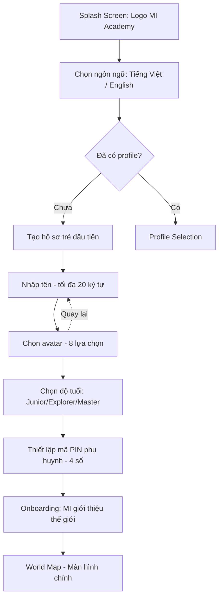
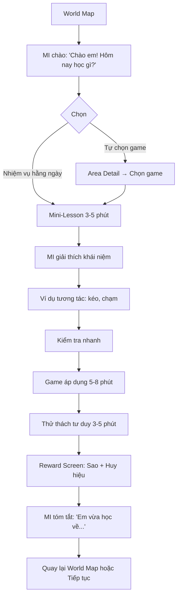
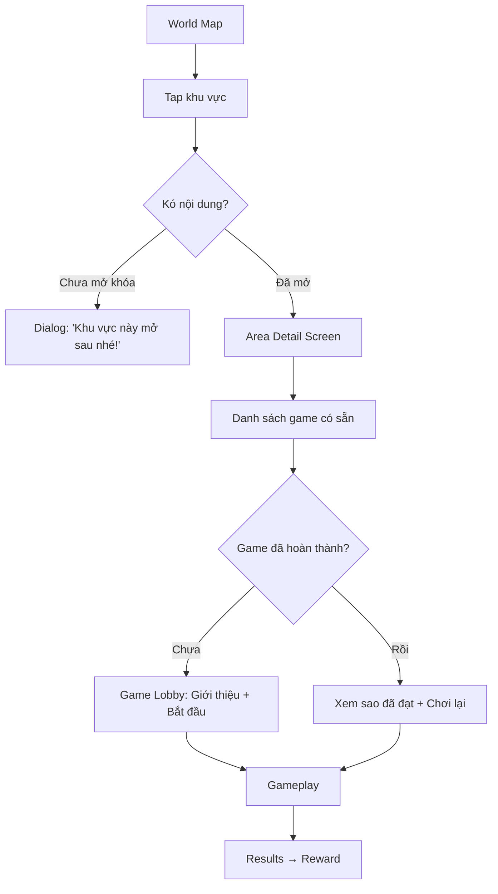
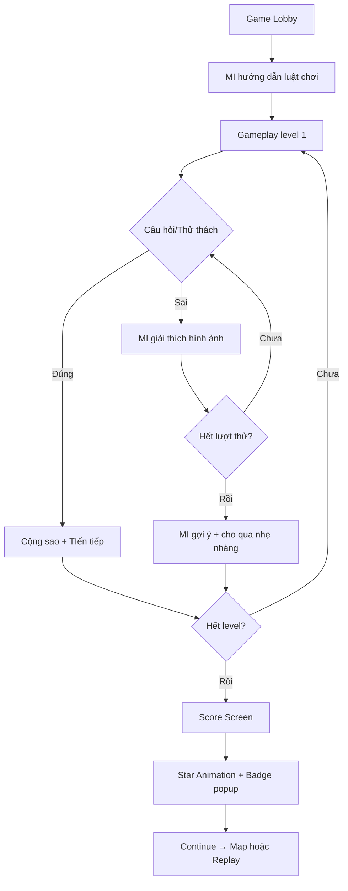
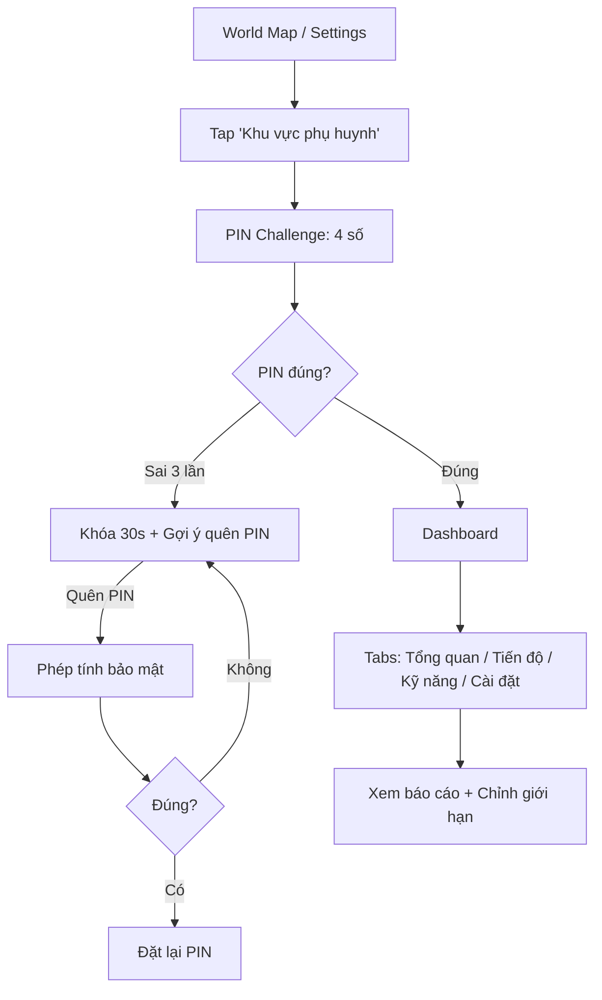
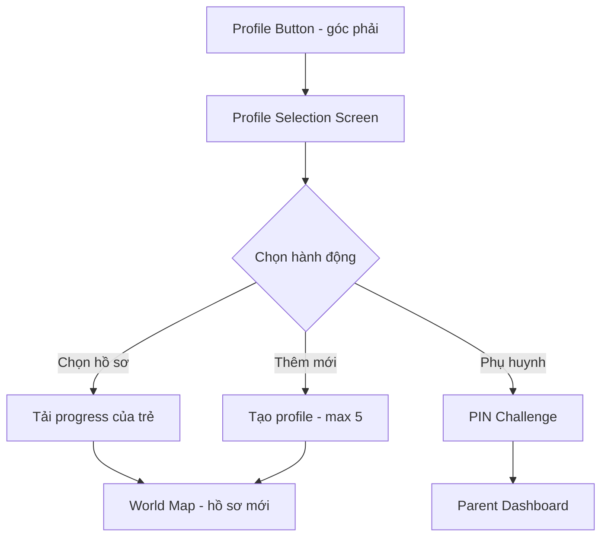
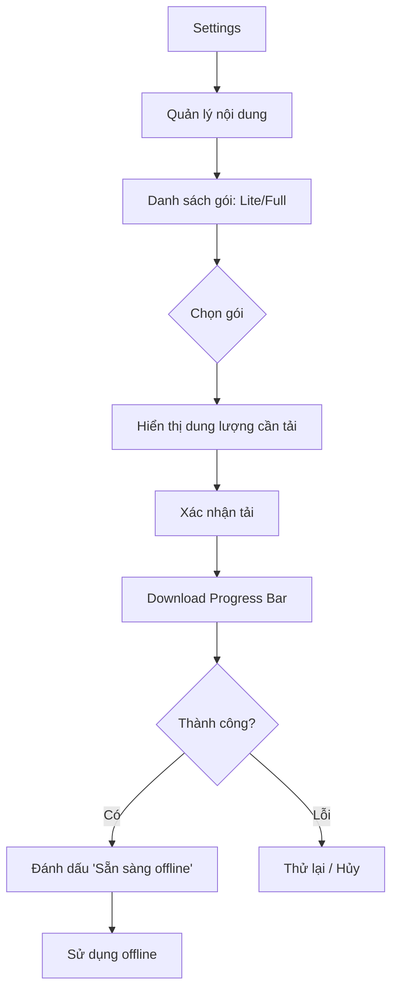
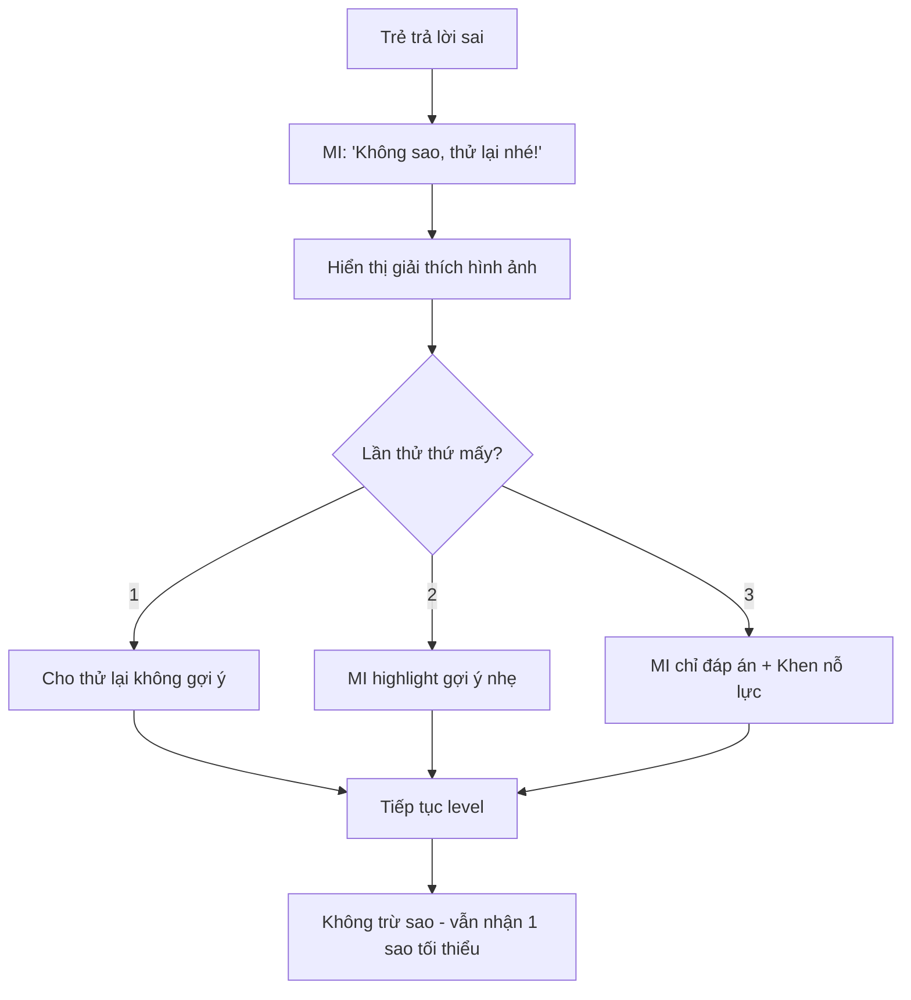
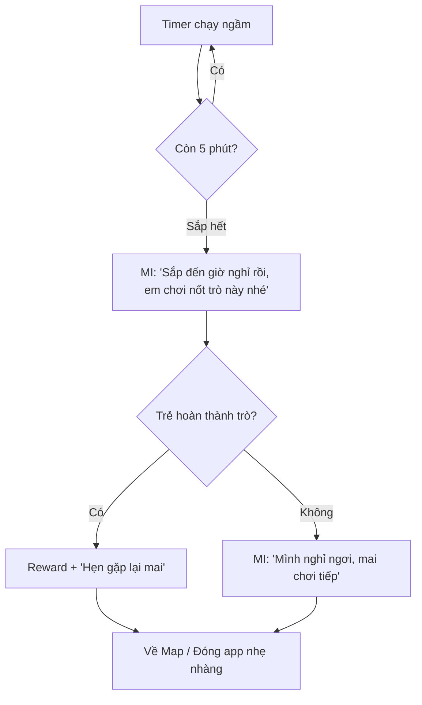

# MI Academy — User Flows (MVP)

> **Công cụ vẽ:** Mermaid (hỗ trợ trong VS Code, GitHub, Notion)  
> **Độ tuổi mục tiêu:** 5–12 tuổi  
> **Nguyên tắc:** Không áp lực, không trừ sao, MI luôn khuyến khích  

---

## 1. First Launch Flow (Lần đầu mở app)

**Ghi chú:**
- Không yêu cầu email, số điện thoại, hay tài khoản mạng xã hội
- PIN dùng cho khu vực phụ huynh; có thể đặt sau nếu bỏ qua
- Onboarding: MI nói "Chào em! Mình là MI, cùng khám phá nhé!"

---

## 2. Daily Learning Loop (Vòng lặp học tập 15–25 phút)

**Ghi chú:**
- Nếu trẻ chọn sai: MI giải thích nhẹ + cho thử lại (không trừ sao)
- Trẻ có thể dừng bất cứ lúc nào (nút home góc trái)

---

## 3. Map Exploration Flow (Khám phá bản đồ)

**Khu vực MVP:**
- ✅ Thành phố chữ cái (Ghép chữ, Nghe âm)
- ✅ Vương quốc toán học (Đường đua, Siêu thị)
- ✅ Đảo tư duy (Ghi nhớ, Robot)
- 🔒 Ngôi nhà sáng tạo (GĐ2)
- 🔒 Phòng thí nghiệm (GĐ2)

---

## 4. Game Flow (Chung cho 6 game MVP)

**Quy tắc:**
- Tối đa 3 lần thử mỗi câu
- Lần 1 đúng: 3 sao; lần 2: 2 sao; lần 3: 1 sao
- Không đồng hồ đếm ngược gây áp lực

---

## 5. Parent Access Flow (Khu vực phụ huynh)

**Bảo mật:**
- PIN không lưu plaintext (bcrypt)
- Sau 3 lần sai → lockout tạm thời
- Không hiện PIN trên màn hình (dạng dots)

---

## 6. Profile Switch Flow (Chuyển hồ sơ)

---

## 7. Offline Download Flow (Tải nội dung)

**Ghi chú:**
- Có thể tải từng gói (toán, chữ, logic) riêng
- Tự động resume nếu mạng mất

---

## 8. Error / Recovery Flow (Khi trẻ gặp khó)

**Nguyên tắc MI:**
- "Em làm tốt rồi!" / "Cố gắng một chút nữa nhé!"
- Không bao giờ: "Sai rồi", "Chậm quá", "Em kém hơn bạn"

---

## 9. Time Limit Flow (Giới hạn thời gian)

**Khác biệt với app khác:**
- MI "mời" nghỉ thay vì "buộc thoát"
- Không có màn hình khóa cứng gây khóc

---

*Tài liệu này là phần của PRD MI Academy v1.0 MVP.*
